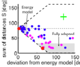
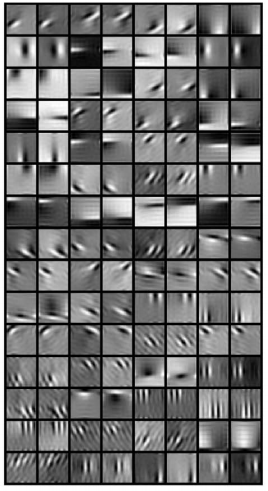

Our primary scientific interest lies in understanding how the brain forms percepts and uses them to make decisions, especially in the visual domain. In particular, we are interested in how the brain's perceptual beliefs about the outside world are represented by the responses of populations of cortical neurons and how their spiking activity gives rise to percepts and decisions. To that end we construct mathematical models that aim to explain neural responses and behavior.

**Key concepts** in the context of our work are _perceptual decision-making, probabilistic inference, neural sampling, noise correlations, choice probabilities, population responses, optimal linear read-out, feedforward, recurrent and top-down processing, covert attention, psychophysical kernel, confirmation bias_.

---
## Research directions
1. [Neural signature of hierarchical probabilistic inference](#neural)
2. [Behavioral signitures of approximate inference](#approx)
3. [Hierarchical causal inference in motion perception](#motion)
4. [Neural implementations of sampling-based inference](#sampling)
5. [Population (de)coding and perceptual decision-making](#classic)
6. [Binocular vision](#binvis)
7. [Natural image statistics](#images)

---

### Neural signature of hierarchical probabilistic inference

About...
- papers

---

### Behavioral signitures of approximate inference

The brain combines noisy and incomplete signals from multiple sources according to their reliability to infer the state of the outside world. The brain's implementation of this process of "probabilistic inference" is necessarily approximate and understanding its computational and neural basis requires a paradigm that can dissociate the three principal sources of suboptimality in perceptual decision-making tasks: sensor noise, model mismatch (mistaken assumptions about the structure of the world), and approximate inference. In this project, we present theoretical insights and experimental results from a new causal inference task involving two auditory and two visual cues that allows such a dissociation. While the auditory cues contain information about the correct choice, the visual cues do not. Despite the fact that the performance of an ideal observer does not depend on the visual cues (even in the presence of sensory noise), human subjects' performance does. We show that this improvement can be explained by a model based on approximate inference (in our case neural sampling). Furthermore, we are able to quantify the "accuracy" of a subject's approximation using psychophysical data. Importantly, in a follow-up experiment, we show that the number of of samples required to explain the data increases as expected with the duration of the stimulus.
- papers

---

### Hierarchical causal inference in motion perception

Our subjective percept of motion differs from the actual velocity on the retina in striking ways that have traditionally been studied by disparate fields. In this project, we present a Bayesian model, as well as new data to support it, that unifies our understanding of motion perception of complex objects ("grouping") with our understanding of the influence of self-motion on our perception ("flow-parsing").
The central (recurring) motif in our hierarchical model is a prior over velocity consisting of a mixture of both a delta and a Gaussian centered on zero. This simple modification of the classic slow speed prior implies a "causal inference" process over whether the object is stationary or moving. Applied to multiple visual elements it leads to a "chunking" of these elements into groups, and groups of groups, with the goal to make the relative speed of as many of the elements zero with respect to the group they are inferred to belong to. As a result, our model infers individual motion relative to a group, and accounts for any inferred self-motion based on optic flow.
Preliminary data from two experiments confirm new predictions of the model.
- papers

---

### Neural implementations of sampling-based inference 

A series of studies building on sparse coding models have shown that V1 receptive fields emerge from learning in a linear Gaussian model of natural images under a sparse prior.  How V1 neurons might implement inference in such a system is less clear, and prior work has typically assumed that network dynamics serve to find the most probable explanation of the visual inputs rather than the full posterior distribution.  Here, we derive a spiking neural network model using deterministic leaky integrate-and-fire (LIF) neurons and stochastic synapses whose responses represent binary samples from the joint posterior given a retinal input.  Simulating the model we find agreement with classic neurophysiological observations about V1 neurons, from approximately contrast-invariant tuning curves to near Poisson variability to small noise correlations with a mean close to zero, to negative causal influences between neurons of similar receptive fields.  Importantly, contrast invariant weights to decode orientation from spikes generated by this model drives the intuition that responses from such a model exhibits key characteristics of both sampling and parametric probabilistic population code over orientation.  Within the context of this model we can understand the underlying cause for each observation, e.g.  why near contrast-invariant orientation tuning is not in contradiction to a sharpening posterior over orientation with increasing contrast, or that the main contribution to near-Poisson variability are stochastic synapses, not feedforward input noise or unreliable neurons – making empirically testable predictions.  With our work we build on and extend prior results and bridge Marr’s three levels, from assuming a computational goal (here, probabilistic inference over visual inputs) to an algorithm (neural sampling) to neural implementation (network of LIF neurons).
- papers

---

### Population (de)coding and perceptual decision-making
<!-- coding and perceptual decision-making") -->
How many sensory neurons contribute to a particular decision, how are they being read out (e.g. optimal or not) and which neurons are they? We have made significant progress recently towards answering these questions by deriving the analytical relationship between noise correlations, choice probabilities and read-out weights. This will allow us to answer two of these questions as soon as multi-electrode recordings from behaving animals become available, i.e. very soon.

- [Nature Neuroscience 16, 235–242 (2013)](http://www.nature.com/neuro/journal/v16/n2/full/nn.3309.html) [PDF+Code+Bibtex](http://bethgelab.org/publications/r.+m.+haefner/)

Applying this framework to neural recordings from MT during a dual motion direction and binocular discrimination task while area V2 was being cooled, we could constrain the origin of the noise correlations in MT.

- [Neuron 81(1), 208-219 (2015)](http://www.cell.com/neuron/abstract/S0896-6273(15)00561-9)

Application to MT data allowed us to investigate the neural basis of the psychophysical suppression effect.

- [Liu et al. 2016 eLife]()

---

### Binocular vision
<!--  -->
Depth perception from binocular images is an exemplary model system for studying how the brain extracts information not explicitly present in its (2D) inputs. We have been particularly interested in understanding what feedforward computations might underlie the observed neurophysiology and how much information different binocular neuron types contain about depth.

- [Neuron 57, vol 1, 147-158 (2008)](http://www.cell.com/neuron/abstract/S0896-6273(07)00980-4) [PDF](http://lsr-web.net/Assets/NEIPages/BruceCumming/pdfs/HaefnerCummingNeuron08.pdf)
- [NeurIPS 2008](http://papers.nips.cc/paper/3461-an-improved-estimator-of-variance-explained-in-the-presence-of-noise) [PDF]() 
- [NeurIPS 2010](http://nips.cc/Conferences/2010/Program/event.php?ID=2122) [PDF](http://books.nips.cc/papers/files/nips23/NIPS2010_0590.pdf)
- [J Neuroscience, 31(22): 8295-8305 (2011)](http://www.jneurosci.org/content/31/22/8295) [PDF](http://lsr-web.net/Assets/NEIPages/BruceCumming/pdfs/TanabeHaefnerBGC2011.pdf)

---

### Natural image statistics
<!--  -->
Understanding the statistics of the natural world is important for understanding the properties of early sensory processing. Traditionally, this argument has been made in the context of efficient coding (Barlow) but what learning principle (objective function) is responsible for the properties of early sensory neurons, e.g. their receptive fields in the case of visual neurons, is still an open question and active field of research. Ultimately, this question is related to what generative model the brain has learnt for its sensory inputs.

- [PLoS Comput Biol 10(3): e1003468](http://www.ploscompbiol.org/article/info%3Adoi%2F10.1371%2Fjournal.pcbi.1003468)

<!-- commented junk below for copy/paste ease -->

<!--### Probabilistic (causal) inference and neural sampling -->

<!--In order to draw inferences about the outside world the brain has to combine sensory information with its learnt knowledge about the structure of the external world. How this is implemented in the brain is still unknown. By generating predictions for classic perceptual tasks, we test the hypothesis that the brain performs probabilistic inference, with neural sensory activity representing posterior beliefs in a generative model of the world.-->
<!--
- [Haefner et al. 2016 (Neuron)](http://www.sciencedirect.com/science/article/pii/S0896627316300113)
- [Lange & Haefner 2017 (Curr Opin Neurobiol)](http://www.sciencedirect.com/science/article/pii/S0959438817300442)
- [Lange & Haefner 2020 (biorxiv)](https://www.biorxiv.org/content/10.1101/081661v4)
- [Lange et al. 2020 (biorxiv)](https://www.biorxiv.org/content/10.1101/440321v3)
-->
<!--
Test of model predictions using data from macaque V1.
- [Bondy, Haefner & Cumming 2018 (Nature Neuroscience)](http://www2.bcs.rochester.edu/sites/haefnerlab/files/Bondy_etal_2018.pdf)
---
-->
